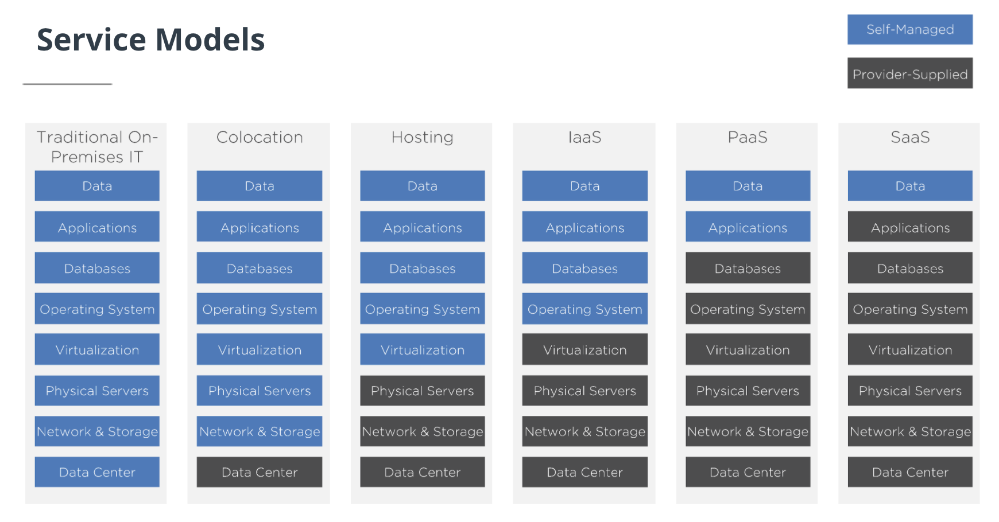

# Understanding the Cloud

[Cloud Models](https://www.youtube.com/watch?v=sogaigPj99c)

## The Cloud is an Experience and a Mindset

## Service Models

- With Infrastructure as a Service, or **IaaS**, you are only managing the workloads and applications that are running on virtual machines and containers.
- With Platform as a Service, or **PaaS**, you are only responsible for applications and their data.
- With a Software as a Service, or **SaaS**, model, every aspect of the infrastructure is provided to you. The only thing that you are required to manage is the data. Everything else is being managed by a provider.

Understanding all of these models is an area of expertise for hybrid cloud engineers in order to know which the best ones are to leverage.
You need to answer 4 main questions to start the organization's digital transformation:

- How do you leave traditional IT behind and become a Cloud consumer?
- How do you choose between application hosts? Infrastructure as a Service, Platform as a Service, or Software as a Service?
- How does your choice impact workload design, deployment, management, and costs?
- Can you leverage multiple models effectively?
