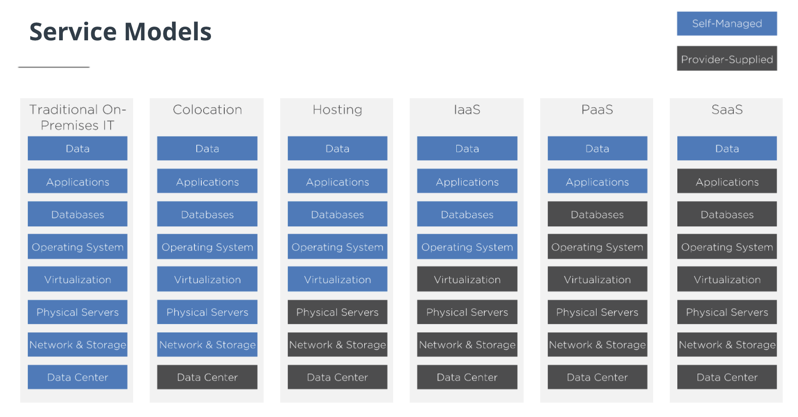

# 1. Lesson Overview

[Intro](https://www.youtube.com/watch?v=C9sg6afLTRo)

[Lesson Outline](https://www.youtube.com/watch?v=3-A2sT0Vr-w)

# 2. Why are Hybrid Cloud Engineers needed

[Role of the Hybrid Cloud Engineer](https://www.youtube.com/watch?v=cFqI8XpvSm0)

## Cloud transformation does not succeeds due to

- A lack of organizational readiness

- Transformation is not driven by critical business objectives.

## Challenges when transitioning to cloud-focused model

- The first one is a lack of organizational readiness. Having a cloud-focused model affects many aspects of the organization outside of the tech-side, like people and processes. Each business has to prepare for these impacts during their Cloud adoption plans.

- Second, adding technology doesn't necessarily add value unless there's a clear goal or outcome to be achieved.

## Who is a Hybrid Cloud Engineer

A hybrid cloud engineer can bring in new technologies quickly, analyze competition, and create comparisons between old and new ways of doing business. Hybrid cloud engineers are able to modernize any organization, but they will find every business increasingly requiring hybrid capabilities to compete on a global scale.

# 3. What does a Hybrid Cloud Engineer do?

[Link](https://www.youtube.com/watch?v=3wUi_t9Tuj8)

## Skills Hybrid Cloud Engineer need to have

### Consulting Skills

- Address organization readiness
- Define business requirements based on SLAs

### Technical Skills

- Plan and execcute the implementation
- Monitor the SLAs defined

# 5. Digital Transformation

[Link](https://www.youtube.com/watch?v=_fi5Zf0OZks)

## IT Evolution

## Resources

- [IDC: Digital transformation spending will eat up 53% of IT budgets by 2023](https://www.techrepublic.com/article/idc-digital-transformation-spending-will-eat-up-50-of-it-budgets-by-2023/)

# 6. Understanding the Cloud

[Cloud Models](https://www.youtube.com/watch?v=sogaigPj99c)

## The Cloud is an Experience and a Mindset

## Service Models

- With Infrastructure as a Service, or **IaaS**, you are only managing the workloads and applications that are running on virtual machines and containers.
- With Platform as a Service, or **PaaS**, you are only responsible for applications and their data.
- With a Software as a Service, or **SaaS**, model, every aspect of the infrastructure is provided to you. The only thing that you are required to manage is the data. Everything else is being managed by a provider.

Understanding all of these models is an area of expertise for hybrid cloud engineers in order to know which the best ones are to leverage.
You need to answer 4 main questions to start the organization's digital transformation:

- How do you leave traditional IT behind and become a Cloud consumer?
- How do you choose between application hosts? Infrastructure as a Service, Platform as a Service, or Software as a Service?
- How does your choice impact workload design, deployment, management, and costs?
- Can you leverage multiple models effectively?

# 7. Application Design: The Monolith

[Link](https://www.youtube.com/watch?v=Am2ncS0uOGg)

Monolith: one, single source of every component in the stack.

Challenges with applications like this are:

## Application

- Single code base for all application functionality.
- Local execution with local data.
- Scale up resources to address performance by increasing CPU memory usage.

## Infrastructure

- It is a single application written in a single language.
- It is provided by a single vendor, who potentially also controls the application development tools, database, and operating system layers that are running on their hardware.

# 8. Application Design: Distributed Web Scale

[Distributed Web Scale](https://www.youtube.com/watch?v=Kr2Ataz3WzU)

## Application

- Functionality distributed accross languages and tiers.
- Each tier can scale out independently to address performance bottlenecks.
- Microservice architecture for functions.

## Infrastructure

- Request to fleet of servers managed by load balancers.
- Fleet facilitate mixing of services.

# 9. The Cloud Differentiator

[Link](https://www.youtube.com/watch?v=iHrTbWwlWHk)

## Resources

- [State of the DevOps Report 2019](https://services.google.com/fh/files/misc/state-of-devops-2019.pdf)

# 10. Cloud Considerations

[Link](https://www.youtube.com/watch?v=XJp3k3bse8w)

## Fiscal Consumption Models

- renting
  - Rent for backups, burst, and temporary workloads
  - The public cloud’s optimal use-case is utility computing for workloads which can be turned on-and-off at will.
- buying
  - Buy for fixed, long-running and ongoing workloads.
  - Business can purchase on-prem private cloud and depreciate that investment as a capital expenditure, or CapEx, but also purchase off-prem private cloud resources for backup, burst load, and temporary workload needs as OpEx to augment their baseline workload capacity.

<!-- TODO: OpEx vs CapEx meaning -->

# 11. Workload Predictability

[Link](https://www.youtube.com/watch?v=76f7Otd8dBY)

## When to use which cloud

### Public cloud

The public cloud is best for elastic workloads. The public cloud allows you to spin up or spin down resources to meet the workload’s demands quickly, easily, and efficiently when a workload is unpredictable.

### Private Cloud

The private cloud is great for predictable workloads. It is a secure and efficient way to run core workloads, with the agility and sit-back simplicity that IT teams want, and with the control that an organization needs for on-prem workloads.

### Hybrid Cloud

Distribute workloads across public and private cloud, still allows you to control and manage them centrally. The overall management of your deployment is simplified this way. This provides the required flexibility to make the best financial choice for your workloads, and deploy them where they run best.
